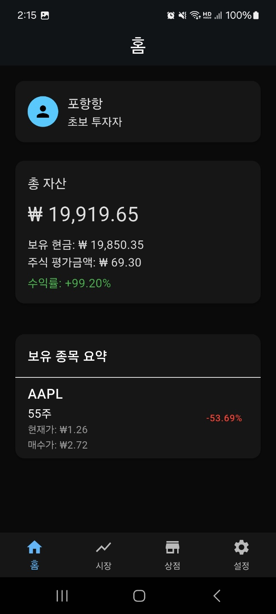
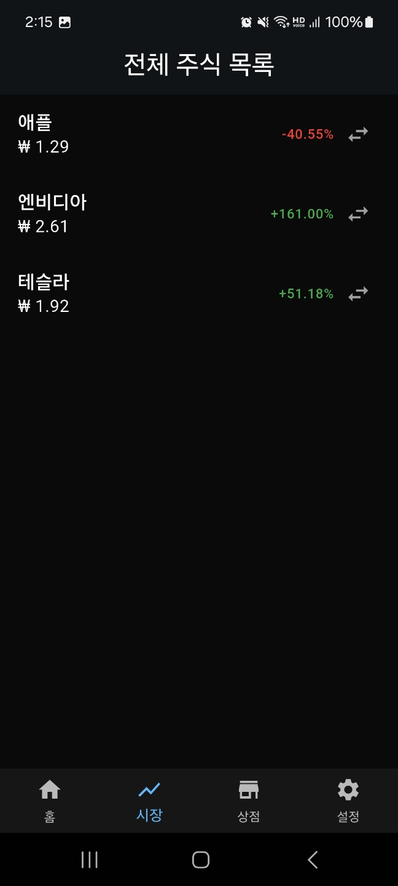
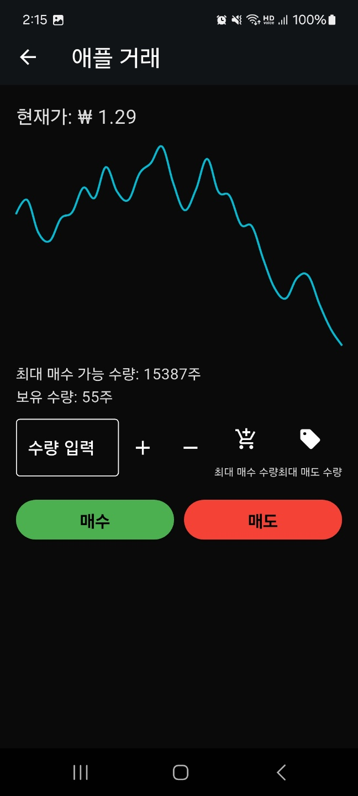
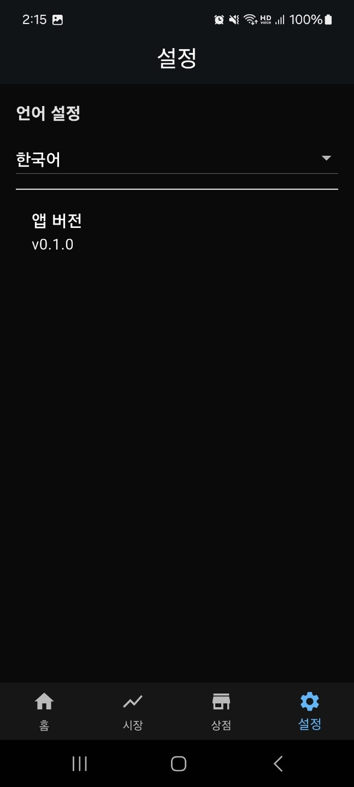

# 📱 Stock Game Client (Flutter)

Flutter로 제작한 **가상 주식 투자 시뮬레이션 앱**입니다.  
NestJS 기반 백엔드 서버와 연동하여 로그인, 자산 확인, 주식 매수/매도 등 다양한 기능을 제공합니다.

> 📌 이 프로젝트는 포트폴리오용 사이드 프로젝트입니다.

---

## ✅ 주요 기능

- **로그인**: 게스트 로그인 (UUID + SharedPreferences)
- **대시보드**:
  - 보유 현금 및 총 자산 표시
  - 수익률 계산
- **보유 종목 확인**
  - 현재 가격, 평가손익, 수익률 표시
- **매수/매도 기능**
  - 거래 가능한 종목 리스트에서 실행
  - 실시간 가격(랜덤 시뮬레이션) 연동
- **서버 연동 API**
  - `/auth/guest-login`, `/dashboard`, `/stocks/:id`, `/trade` 등

---

## 🖼️ 스크린샷

| 로그인 | 대시보드 | 종목 목록 |
|--------|-----------|------------|
|  |  |  |

| 개별 종목 거래 | 상점 (광고 보상) | 설정 |
|----------------|-------------------|------|
|  |  |  |

---

## ⚙️ 사용 기술

- **Flutter 3.x**
- **상태 관리**: GetX (`Obx`, `Rx`, `Controller`)
- **로컬 저장소**: SharedPreferences
- **HTTP 통신**: `http` 패키지
- **라우팅**: GetX Named Routing
- **기타**: UUID 기반 유저 식별

---

## 📦 실행 방법

```bash
git clone https://github.com/yourname/stock-game-client.git
cd stock-game-client
flutter pub get
flutter run
